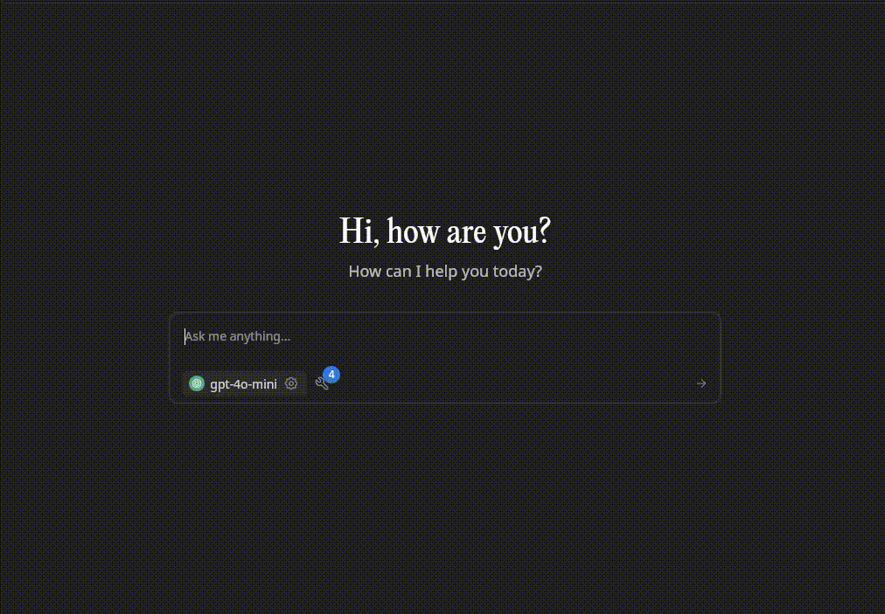

# Meilisearch MCP

A high-performance Go implementation of the Model Context Protocol (MCP) for Meilisearch. This server enables AI tooling (desktop & cloud) to connect with your Meilisearch data using the MCP standard over HTTP or stdio.

<p align="center">
  
</p>


## Table of Contents
- [Features](#features)
- [Quick Start](#quick-start)
    - [Connect to Remote MCP Server](#1-connect-to-remote-mcp-server)
    - [Download Latest Release](#2-download-latest-release)
    - [Build from Source](#3-build-from-source)
        - [Prerequisites](#prerequisites)
        - [Build](#build)
        - [Run (HTTP Transport)](#run-http-transport)
        - [Run (STDIO Transport)](#run-stdio-transport)
- [Docker](#docker)
    - [Build Image](#build-image)
    - [Run Container](#run-container)
    - [Environment Variables](#environment-variables)
    - [docker-compose Example](#docker-compose-example)
- [Configuration Examples](#configuration-examples)
    - [Generic HTTP (mcp-remote)](#generic-http-mcp-remote)
    - [Local STDIO](#local-stdio)
- [Supported Clients](#supported-clients)
- [Security Notes](#security-notes)
- [Resources](#resources)
- [Contributing](#contributing)
- [License](#license)


## Features
- **Full-featured Meilisearch integration**: Supports the complete Meilisearch API for search, indexing, and management.
- **MCP over HTTP, SSE and stdio**: Flexible transport for local and remote use, with HTTP and SSE supporting multiple clients and multi-instance connections.
- **Secure by design**: Built-in support for API keys, recommended TLS via reverse proxy, and security best practices for header forwarding and rate limiting.
- **Streaming JSON**: Efficient newline-delimited streaming for requests and responses.
- **Configurable**: Easily connect to any Meilisearch instance and manage API keys per client.
- **Multi-client, multi-instance support**: HTTP transport allows multiple clients to connect simultaneously, each with their own Meilisearch instance and API key.
- **Remote MCP server available**: Use the public MCP endpoint at https://meilisearch.javad.dev for remote access and testing.
- **Open Source**: MIT licensed.

## Quick Start

### 1. Connect to Remote MCP Server
You can use the public MCP server at:

```
https://meilisearch.javad.dev/mcp
```

Example configuration for `mcp-remote`:

```json
{
  "command": "npx",
  "args": ["-y","mcp-remote@latest","https://meilisearch.javad.dev/mcp", "--header","X-Meili-Instance: ${MEILISEARCH_INSTANCE}", "--header","X-Meili-APIKey: ${MEILISEARCH_API_KEY}"],
  "env": {"MEILISEARCH_INSTANCE": "http://localhost:7700", "MEILISEARCH_API_KEY": "masterKey"},
  "active": true
}
```

### 2. Download Latest Release
Download the latest binary from the [releases page](https://github.com/ja7ad/meilisearch-mcp/releases) and extract it:

```sh
wget https://github.com/ja7ad/meilisearch-mcp/releases/latest/download/mcp
chmod +x mcp
```

### 3. Build from Source

#### Prerequisites
- Go 1.20+ (for building from source)
- [Meilisearch](https://www.meilisearch.com/) instance (local or remote)

#### Build
```sh
git clone https://github.com/ja7ad/meilisearch-mcp.git
cd meilisearch-mcp
make build
```

#### Run (HTTP Transport)
```sh
./build/meilisearch-mcp serve http --addr :8080 --meili-host http://localhost:7700 --meili-api-key masterKey
```
Optionally enable Server-Sent Events streaming:
```sh
./build/meilisearch-mcp serve http --addr :8080 --meili-host http://localhost:7700 --meili-api-key masterKey --sse
```

#### Run (STDIO Transport)
```sh
./build/meilisearch-mcp serve stdio --meili-host http://localhost:7700 --meili-api-key masterKey
```

## Docker

### Build Image
```sh
docker build -t meilisearch-mcp:latest .
```

### Run Container
```sh
docker run --rm -p 8080:8080 \
  -e MEILI_HOST=http://host.docker.internal:7700 \
  -e MEILI_API_KEY=masterKey \
  meilisearch-mcp:latest
```
Enable SSE in the container:
```sh
docker run --rm -p 8080:8080 \
  -e MEILI_HOST=http://host.docker.internal:7700 \
  -e MEILI_API_KEY=masterKey \
  -e MCP_ENABLE_SSE=true \
  meilisearch-mcp:latest
```

### Environment Variables
- MEILI_HOST (default: http://localhost:7700)
- MEILI_API_KEY (optional)
- MCP_ADDR (default: :8080)
- MCP_POOL_SIZE (default: 100)
- MCP_POOL_DURATION (default: 5m)
- MCP_RATE_LIMIT_RPS (default: 300)
- MCP_ENABLE_SSE (set to true/1/yes to add --sse flag and enable Server-Sent Events streaming)
- MCP_DEBUG (1 to enable --debug)

### docker-compose Example
```yaml
services:
  mcp:
    image: meilisearch-mcp:latest
    build: .
    environment:
      MEILI_HOST: http://meili:7700
      MEILI_API_KEY: ${MEILI_API_KEY:-masterKey}
      MCP_RATE_LIMIT_RPS: 200
      MCP_ENABLE_SSE: true  # enable SSE
    ports:
      - "8080:8080"
    depends_on:
      - meili
  meili:
    image: getmeili/meilisearch:latest
    environment:
      MEILI_MASTER_KEY: masterKey
    ports:
      - "7700:7700"
```

## Configuration Examples

### Generic HTTP (mcp-remote)
```json
{
  "command": "npx",
  "args": ["-y","mcp-remote@latest","https://meilisearch.javad.dev/mcp", "--header","X-Meili-Instance: ${MEILISEARCH_INSTANCE}", "--header","X-Meili-APIKey: ${MEILISEARCH_API_KEY}"],
  "env": {"MEILISEARCH_INSTANCE": "http://localhost:7700", "MEILISEARCH_API_KEY": "masterKey"},
  "active": true
}
```

### Local STDIO
```json
{
  "command": "/usr/bin/meilisearch-mcp",
  "args": ["serve", "stdio","--meili-host","http://localhost:7700","--meili-api-key","masterKey"],
  "env": {},
  "active": false
}
```

> Flip `active` flags to select transport. Prefer stdio locally; HTTP for remote/container usage.

## Supported Clients
- **Jan** (desktop) – native MCP provider config
- **Claude Desktop** – tool integration (future MCP support)
- **Cursor / VS Code (Continue)** – configure remote/stdio MCP backend
- **Zed / JetBrains (plugins)** – emerging MCP adopters
- **Custom** – use `mcp-remote` CLI or direct HTTP POST

## Security Notes
- Place behind TLS (reverse proxy) when exposed publicly
- Forward required auth headers only; strip unknown ones
- Enforce payload size limits & rate limiting at the proxy

## Resources
- [Meilisearch](https://www.meilisearch.com/)
- [MCP Spec](https://github.com/modelcontextprotocol)
- [Project GitHub](https://github.com/ja7ad/meilisearch-mcp)

## Contributing
Contributions welcome! See [CONTRIBUTING.md](./CONTRIBUTING.md) for setup, commit message conventions (`feat:`, `fix:`, `chore:`, `test:`, `ci:` etc.), and required PR title prefixes (`[Feat]`, `[Fix]`, `[Chore]`, `[Refactor]`, etc.).

## License
MIT
